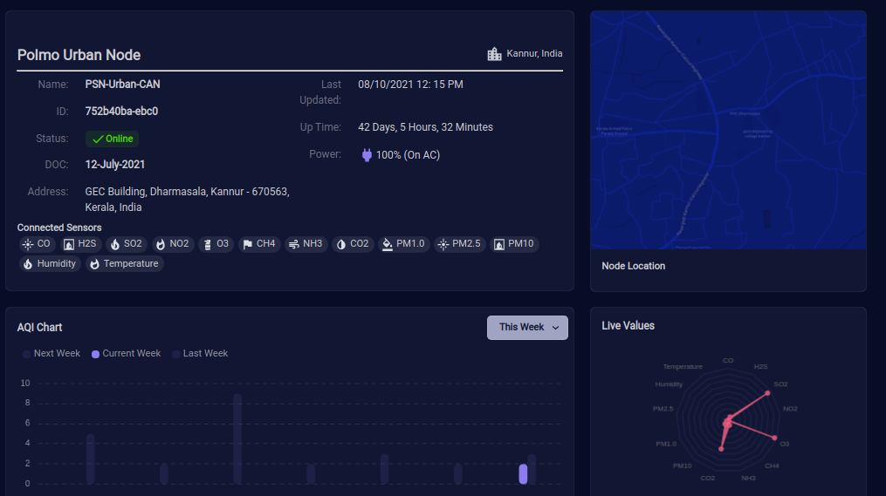

# POLMO Web UI

[](https://polmo-react-app.vercel.app/)


## The problem
Air pollution is a major threat to every existing life in the world even serveral meassures taken to control it. Monitoring is the first level solution for controling the pollution. [Read more about air pollution in Further readings section](#further-readings)

In india, there are several pollution monitoring stations such as AAQMS and CAAQMS. Such system needs frequent calibrations, huge initail and maintainance costs and spaces. Hence those are only implemented in critical areas. Those also takes minutes to get the readings. 

Several pollution causes is not sustaining and only exists for a few period. Identifying and monitoring such are riskier and coslty. 

## Our Solution
Polmo is an IOT based Air pollution sensing network. It consists of several node types containing different gas sensors. each node will be connected to the cloud directly or through the parent node or nodes in the chain. 

## The Plan
 The major plan was to use advanced sensor algorithms, machine learning, and predictions.

### Nodes and Purpose
According to environment and requirement, different nodes types need to be created. Popular types of nodes that under development are: 
1. Polmo Urban - ( For cities and high polluted and vulnarable areas)
2. Polmo Green - ( For Rural areas )
3. Polmo Indoor - ( For industries and indoor)

Each node is made and configured according to the specific enviornaments, major polutants. So the data accuracy, sensor type, monitoring frequency may vary among these. 

## Dashboard Preview


## Installation

 This dashboard can be installed locally by cloning the repository and running install command like any react app created using `create-react-app`:

```
npm install
```

It will download all requierd `dependancies` and install them. After you can run local server using :

```
npm start
```
To build the production version of the dashboard you can simply use:
```
npm build
```

## Contribuiting
Pull requests are welcome. For major changes, please open an issue first to discuss what you would like to change.

For maintaining the repository more neat and informative, commit messages should be proper and self informative. This repo uses `huskey`, `commitlint` and `git-emoji` configs to protect noninformative commit messages.
Every commit message should follow the format below:
```
:emoji: <type>: <Commit message>
```

## Licence
[Apache 2.0](LICENSE)


## Further Reading

- [How air pollution is destroying our health - WHO](https://www.who.int/news-room/spotlight/how-air-pollution-is-destroying-our-health)
- [Environmental and Health Impacts of Air Pollution - Frontiers](https://www.frontiersin.org/articles/10.3389/fpubh.2020.00014/full)
- [Air pollution - National Geographic](https://www.nationalgeographic.org/encyclopedia/air-pollution/)
- [Effects of Air Pollution on Agricultural Crops](http://www.omafra.gov.on.ca/english/crops/facts/01-015.htm)